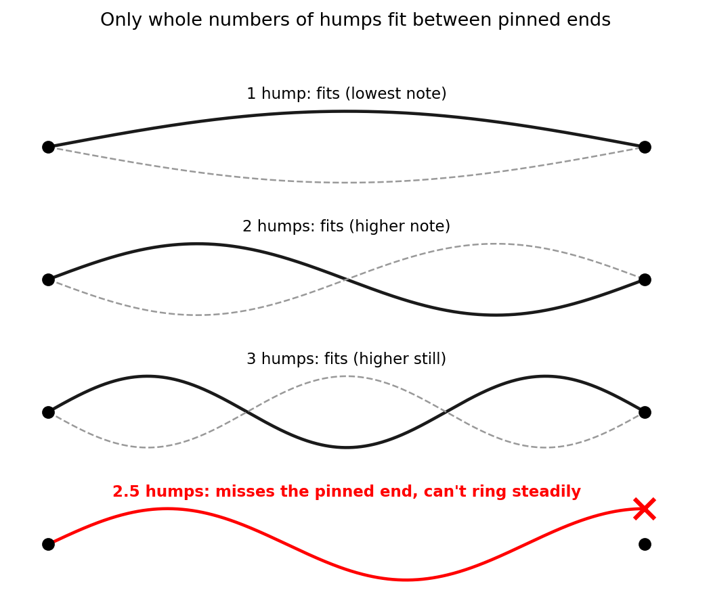

<!-- strategy: classical-contrast: the atom that shouldn't exist -->

Quantum mechanics is the physics that explains what everyday matter is and why it holds together: why atoms exist at all, why every atom of ordinary hydrogen has the same allowed energies, and why each element glows in its own particular colors. It is the theory of electrons, atoms and light, and chemistry and much of modern technology rest on it. The best way in is the atom, where the older physics failed.

Experiments show an atom is a tiny, heavy, positive nucleus with much lighter, negative electrons around it. Classical physics, superb for motors, radio and the solar system, says the electrons must circle the nucleus like planets around the Sun, or they would fall straight in.

Then it predicts disaster. A charge that keeps changing direction radiates light (that's how radio antennas broadcast), so the circling electron should lose energy and spiral into the nucleus in about a hundred-billionth of a second. And since orbits could be any size, nothing would make two atoms match, and glowing gas would give off a smooth smear of all colors.

Nature disagrees on every count. Atoms don't collapse. Every atom of ordinary hydrogen has the same allowed energies. And glowing hydrogen gives off a few bright, sharp colors, like a barcode, not a rainbow.

For hydrogen's electron, quantum mechanics replaces the orbit with a pattern of amplitudes spread around the nucleus, a bit like the heights of a wave. The size of the amplitude at a spot, squared, gives the chance of finding the electron near that spot if you look. That map of chances is the "electron cloud"; each look finds the whole electron at one spot.

The crucial rule: only certain patterns are steady, keeping their shape with one definite energy. Compare a guitar string. With its ends pinned, it rings in a steady pattern only if the pattern fits: one hump, two, three, and so on, each with its own note.

The comparison has limits: the atom's patterns are patterns of amplitude, not of vibrating material, and hydrogen's energies crowd together toward the top, while an ideal string's frequencies are evenly spaced. But the nucleus's pull plays the part of the pinned ends: only certain steady patterns fit, and their energies form a ladder. While the electron stays in the atom, measuring its energy always gives one of the rungs, never anything in between. (Measured very precisely, each rung turns out to be a tight cluster of sub-rungs.) Physics, not history, sets the ladder, so every atom of ordinary hydrogen has the same one.

That explains the barcode. When the electron drops to a lower rung, the atom usually gives off a single photon, a packet of light whose energy is set by the size of the drop. The one equation here, $E = hf$, says a photon's energy $E$ is a fixed number $h$ (Planck's constant) times its frequency $f$. So the photon from a given drop has one sharply defined frequency, making one line of the barcode, and bigger drops give higher frequencies. Your eye sees visible frequencies as colors, from red (lowest) to violet (highest). Rung 3 to rung 2 gives hydrogen's red line (wavelength 656 nanometers) and rung 4 to rung 2 its blue-green one, while rung 2 to rung 1 gives invisible ultraviolet. Every kind of atom has its own ladder and so its own barcode, which is how astronomers recognize hydrogen in stars.

![Left: hydrogen's energy ladder, drawn to scale. Each colored arrow is a drop to rung 2 that makes one visible line, and bigger drops make bluer lines; the drop from rung 2 to rung 1 gives invisible ultraviolet, and the grey higher rungs crowd toward the line where the electron is set free. Right: the smooth rainbow classical physics predicts (schematic) against the barcode glowing hydrogen atoms actually give off (line positions to scale, brightness only suggested): four bright lines, plus fainter ones crowding toward 365 nm in the ultraviolet, just as the rungs crowd toward the top.](figures/c-ladder-spectrum.png)

So why doesn't the electron fall in? Squeezing the pattern closer to the nucleus would let the electron feel more pull. But a wave squeezed into less space wiggles more sharply; that's why pressing a guitar string to a fret, so a shorter piece vibrates, raises its note. In quantum mechanics, sharper wiggles mean more energy of motion. The bottom rung is the best balance between pull and wiggle; this trade-off is closely related to the uncertainty principle, a property of waves, not of clumsy measurement. In an atom left alone, an electron on a higher rung drops down sooner or later, giving off light, but from the bottom of the ladder there is nowhere lower to go.

So the solar-system picture has to go. Standard quantum mechanics gives the electron no path: in hydrogen's lowest state the cloud is a round, fuzzy ball and nothing orbits. Yet measure the electron's speed in that state and you usually get more than a thousand kilometers per second, because squeezing gives it energy of motion. (Interpretations of quantum mechanics differ on whether it has a path anyway, and on what it does between looks.)

That is what quantum mechanics is about: patterns of amplitude where classical physics had paths, clouds of chance where it had certainties, and ladders of allowed energies for anything trapped. Add one more quantum rule, that no two electrons can be in exactly the same state, so bigger atoms must fill their ladders upward, and you get the periodic table, chemical bonds, why solids are solid, and the transistors, LEDs and lasers of modern technology. Its predictions have been tested to extraordinary precision; what it means underneath is still debated.

Next step: how that one rule builds the periodic table.

**Check yourself:** If an atom's ladder had only three rungs, how many different sharp lines (visible or not), at most, could its barcode have?
